**计算机组成原理课程设计报告**

**姓名：苑宗鹤**

**学号：201705130120**

**班级：2017计科1班**

[项目地址&&完整代码](https://github.com/Yuandiaodiaodiao/a-sample-cpu)


[TOC]

# 零、分工

曹远: Verilog

苑宗鹤: 流水线设计

# 一、课程设计环境

## 1.硬件环境

FPGA电路：Cyclone IV E EP4CE6E228C8芯片

## 2.软件环境

Quartus II 13.1 

modelsim 

pycharm

# 二、微程序控制的运算器设计

## 1.算术逻辑运算单元ALU的设计

分析4位超前进位加法器74181的逻辑结构,可以将其拓展到8位超前进位加法器

对于输入x[0:7] y[0:7]

定义G项 Gi=xi * yi

定义P项 Pi=xi⊕yi

则进位项 Ci+1=Gi+Pi * Ci

则可以推导出4位超前进位加法器的进位链为

C0 = Cin

C1=G0 + P0·C0

C2=G1 + P1·C1 = G1 + P1·（G0 + P0·C0）=G1 + P1·G0 + P1·P0 ▪C0

C3=G2 + P2·C2 = G2 + P2·G1 + P2·P1·G0 + P2·P1·P0·C0

C4=G3 + P3·C3 = G3 + P3·G2 + P3·P2·G1 + P3·P2·P1·G0 + P3·P2·P1·P0·C0

则可以以此类推出8bit的超前进位链

附录:8bit超前进位加法器

##  2.运算器结构

8bit寄存器 R0,R1连接至ALU的输入A与输入B

8bit寄存器 R2 连接至ALU的输出

由打入脉冲cpr0 cpr1 cpr2控制三个寄存器的输入

## 3.微程序控制器的结构

μPC由两个74161组成8bit加法计数器 用来控制rom读出下一条微指令

## 4.时序

上边沿

- rom工作 从rom中读入μPC提供的地址 输出rom中的内容

下边沿

- alu工作 存入rom输出的数值运算后输出结果
- μPC工作 将微程序地址+1

 

 

# 三、微程序控制的存储器读写系统设计

 ## 1.微指令设计

| bit  |        7        |       6       |       5        |     4      |     3     |      2      |      1      |     0     |
| :--: | :-------------: | :-----------: | :------------: | :--------: | :-------: | :---------: | :---------: | :-------: |
| 定义 |       oe        |      xpc      |      xmar      |    cppc    |    cpr    |    cpmar    |     wr      |    rd     |
| 功能 | 控制R的输出使能 | ram送入pc地址 | ram送入mar地址 | pc自增脉冲 | R打入脉冲 | mar打入脉冲 | ram写入使能 | ram读使能 |

## 2.微指令编写

- 读出地址ad1放入MAR寄存器：XPC、RD、CPMAR 1000101
- M（ad1）即x 送入寄存器R: XMAR、RD、CPR、CPPC 111001
- 读出ad2送入MAR: 1000101
- x 送入地址ad2中 XMAR、WR、OE有效 : 10100010

## 3.时序

上边沿

- Rom工作 读入微地址 输出微指令
- 寄存器工作 按照cpmar和cpr对寄存器mar和R的数据进行刷新

下边沿

- ram工作 根据wr和rd的值进行读写
- μPC工作 根据clock进行自增


# 四、简单模型机的设计(微程序实现）

## 1.流水线设计

本实验按照mips五级流水线结构设计

五个阶段分为 IF -> ID -> EX -> MEM -> WB

取址->译码->执行->访存->写回

- 取址模块

  - 由pc寄存器提供地址 指令ROM按照CLK 取出对应地址的指令

  - 取得指令后,根据指令操作码从微指令ROM中取出接下来4个阶段执行所需要的全部微指令
  - 根据指令对微指令进行解码准备送入下一阶段

- 译码模块 
  - 根据指令中提供的寄存器id从寄存器堆中取出对应的数据
  - 根据微指令调整寄存器数据与立即数数据准备送入下一阶段
  - 处理从EX阶段转发回的数据
  - 处理从MEM阶段转发回的数据

- 执行模块 
  - alu读入两个操作数和操作码进行运算
  - 直送立即数到下一个阶段
  - 如果为分支指令则进行分支运算操作PC寄存器
  - 处理从MEM阶段转发回的数据
  - 转发数据至ID

- 访存模块 
  - 根据微指令中的wr和rd进行读/写
  - 转发数据至ID,EX阶段


- 写回模块 

  - 写回寄存器堆

    

## 2.设计指令系统

指令系统设计为16bit指令集

仿照mips指令集设计功能

| bit                    | 15:11 | 10:8 | 7:5      | 4:2      | 1:0      |
| ---------------------- | ----- | ---- | -------- | -------- | -------- |
| 三寄存器               | op    | r1   | r2       | r3       |          |
| 两寄存器一立即数(5bit) | op    | r1   | r2       | num[4:2] | num[1:0] |
| 一寄存器一立即数(8bit) | op    | r1   | num[7:5] | num[4:2] | num[1:0] |
| 立即数(8bit)           | op    |      | num[7:5] | num[4:2] | num[1:0] |

| 操作 | op    |      |         |      | 功能                  |
| ---- | ----- | ---- | ------- | ---- | --------------------- |
| add  | 00001 | r1   | r2      | r3   | r1=r2+r3              |
| sub  | 00010 | r1   | r2      | r3   | r1=r2-r3              |
| and  | 00011 | r1   | r2      | r3   | r1=r2 & r3            |
| or   | 00100 | r1   | r2      | r3   | r1=r2 \| r3           |
| xor  | 00101 | r1   | r2      | r3   | r1=r2 ^ r3            |
| nor  | 00110 | r1   | r2      | r3   | r1=! (r2 \| r3)       |
| slt  | 00111 | r1   | r2      | r3   | r1=r2>r3?1:0          |
| nop  | 00000 |      |         |      |                       |
| sll  | 01000 | r1   | r2      | num  | r1=r2<<num            |
| srl  | 01001 | r1   | r2      | num  | r1=r2>>num            |
| addi | 01010 | r1   | r2      | num  | r1=r2+num             |
| lb   | 01011 | r1   | r2 3bit | num  | r1=ram[r2+num]        |
| mul  | 01100 | 0    | r1      | r2   | r1*r2=>hi,lo          |
| div  | 01101 | 0    | r1      | r2   | r1/r2=>lo, 余数=>hi   |
| mfhi | 01110 | r1   |         |      | r1=hi                 |
| mflo | 01111 | r1   |         |      | r1=lo                 |
| sb   | 10000 | r1   | r2      | num  | ram[r2+num]=r1        |
| beq  | 10001 | r1   | r2      | num  | r1==r2 ? GOTO PC+num  |
| bne  | 10010 | r1   | r2      | num  | r1!=r2 ?  GOTO PC+num |
| j    | 11000 |      | num     | num  | GOTO num              |
| jr   | 11001 | r1   |         |      | goto r1               |
| pln  | 11010 | r1   |         |      | print r1              |
| beqz | 11011 | r1   | num     | num  | r1==0 ? GOTOPC+num    |
| bnez | 10100 | r1   | num     | num  | r1!=0 ? GOTOPC+num    |

## 3.微指令设计

微指令设计为16bit

根据指令对应的op取出ram中对应的指令

| bit  |             | 功能                                                     |
| ---- | ----------- | -------------------------------------------------------- |
| 0    | chooser2[0] | 2bit 选择R1 R2 立即数 三选二  00=>0 01=>ab 10=>bc 11=>ac |
| 1    | chooser2[1] |                                                          |
| 2    | S0          | alu操作码0                                               |
| 3    | S1          | alu操作码1                                               |
| 4    | S2          | alu操作码2                                               |
| 5    | S3          | alu操作码3                                               |
| 6    | M           | alu逻辑运算                                              |
| 7    | CN          | alu进位                                                  |
| 8    | wren        | ram写入控制                                              |
| 9    | rden        | ram读入控制                                              |
| 10   | twoOne      | ram输出/alu结果 写回选择 0=>ram 1=>alu                   |
| 11   | branch      | 分支                                                     |
| 12   | regWd       | 寄存器写回使能                                           |
| 13   | print       | 控制数码管打印                                           |
| 14   | branchA     | 立即数跳转分支                                           |
| 15   | branchB     | 译码跳转分支                                             |

部分微指令如下

| op   | 0    | 1    | 2    | 3    | 4    | 5    | 6    | 7    | 8    | 9    | A    | B    | C    | D    | E    | F    |      |
| ---- | ---- | ---- | ---- | ---- | ---- | ---- | ---- | ---- | ---- | ---- | ---- | ---- | ---- | ---- | ---- | ---- | ---- |
| addi | 1    | 1    | 1    | 0    | 0    | 1    | 0    | 1    | 0    | 0    | 1    | 0    | 1    |      |      |      | 14A7 |
| pln  | 1    | 0    | 0    | 0    | 0    | 0    | 0    | 0    | 0    | 0    | 0    | 0    | 0    | 1    | 0    | 0    | 2001 |
| div  | 1    | 0    | 0    | 0    | 1    | 0    | 0    | 0    | 0    | 0    | 0    | 0    | 0    |      |      |      | 0011 |
| mfhi |      |      |      |      |      |      |      | 1    | 0    | 0    | 1    | 0    | 1    |      |      |      | 1488 |
| mflo |      |      |      |      |      |      |      | 1    | 0    | 0    | 1    | 0    | 1    |      |      |      | 1490 |
| mul  | 1    | 0    | 0    | 1    | 0    | 0    | 0    | 0    | 0    | 0    | 0    | 0    | 0    |      |      |      | 0009 |
| or   | 1    | 0    | 0    | 1    | 1    | 1    | 1    | 0    | 0    | 0    | 1    | 0    | 1    |      |      |      | 1479 |
| add  | 1    | 0    | 1    | 0    | 0    | 1    | 0    | 1    | 0    | 0    | 1    | 0    | 1    |      |      |      | 14A5 |
| sub  | 1    | 0    | 0    | 1    | 1    | 0    | 0    | 0    | 0    | 0    | 1    | 0    | 1    |      |      |      | 1419 |
| jr   | 0    | 1    | 1    | 1    | 0    | 0    | 0    | 0    | 0    | 0    | 0    | 1    | 0    |      |      | 1    | 80E  |
| lb   | 1    | 1    | 1    | 0    | 0    | 1    | 0    | 1    | 0    | 1    | 0    | 0    | 1    |      |      |      | 12A7 |
| sb   | 0    | 1    | 1    | 0    | 0    | 1    | 0    | 1    | 1    | 0    | 0    | 0    | 0    |      |      |      | 1A6  |
| nop  | 0    | 0    | 0    | 0    | 0    | 0    | 0    | 0    | 0    | 0    | 0    | 0    | 0    |      |      |      | 0    |
| beq  | 1    | 0    | 0    | 1    | 1    | 0    | 0    | 0    | 0    | 0    | 0    | 1    | 0    |      |      |      | 819  |
| addi | 1    | 1    | 1    | 0    | 0    | 1    | 0    | 1    | 0    | 0    | 1    | 0    | 1    |      |      |      | 14A7 |
| j    | 1    | 0    | 1    | 1    | 0    | 0    | 0    | 0    | 0    | 0    | 0    | 1    | 0    |      | 1    |      | 80D  |
| bne  | 1    | 0    | 0    | 1    | 1    | 0    | 1    | 0    | 0    | 0    | 0    | 1    | 0    |      |      |      | 859  |
| and  | 1    | 0    | 1    | 1    | 0    | 1    | 1    | 0    | 0    | 0    | 1    | 0    | 1    |      |      |      | 146D |
| xor  | 1    | 0    | 1    | 0   | 1   | 1    | 0   | 0    | 0    | 0    | 1    | 0    | 1    |      |      |      | 1435 |
| nor  | 1    | 0    | 0   | 0   | 0    | 0   | 0   | 1   | 0    | 0    | 1    | 0    | 1    |      |      |      | 1481 |
| slt  | 1    | 0    | 1    | 1    | 1   | 1    | 1    | 0    | 0    | 0    | 1    | 0    | 1    |      |      |      | 147D |
| sll  | 1    | 0  | 1    | 0   | 1   | 0   | 0   | 0    | 0    | 0    | 1    | 0    | 1    |      |      |      | 1415 |
| srl  | 1    | 0    | 0   | 1   | 1   | 1    | 1    | 0    | 0    | 0    | 1    | 0    | 1    |      |      |      | 1479 |
| beqz  | 1    | 0    | 1  | 1   | 0    | 1   | 0   | 0    | 0    | 0    | 0   | 1   | 0   |      |      |      | 082D |
| bnez  | 1    | 0    | 0   | 0   | 1   | 1   | 0   | 0    | 0    | 0    | 0   | 1   | 0   |      |      |      | 0831 |


## 4.数据冒险的解决

### 1.EX转发EX

下一条指令使用到了上一条指令的寄存器 由于写回需要两个clock

所以需要从EX执行后将更新过的寄存器数据转发至EX之前

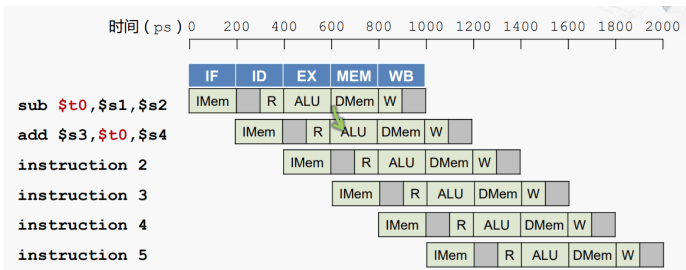

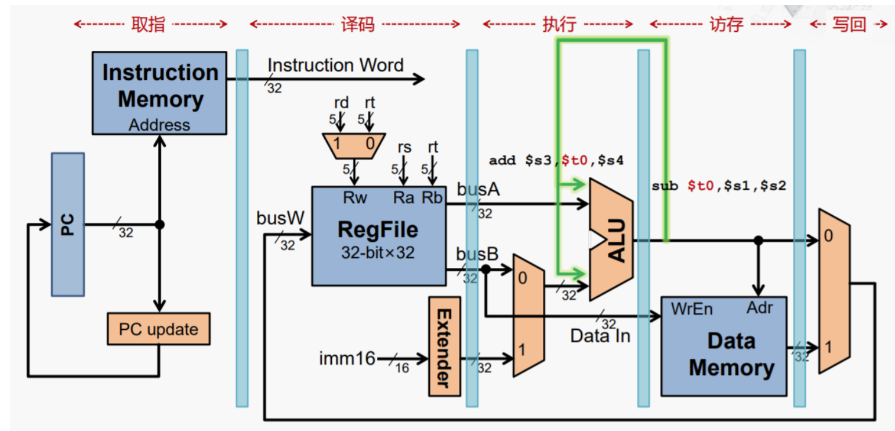

### 2.MEM转发EX

写回一个寄存器需要2CLOCK 在所以当两条指令有一TICK间隔时也不能刷新寄存器堆中的数据

同样需要做转发

而如果是第一条指令从MEM读出数据到寄存器中

而第二条指令是需要ALU计算寄存器中数据的

需要NOP一个指令周期

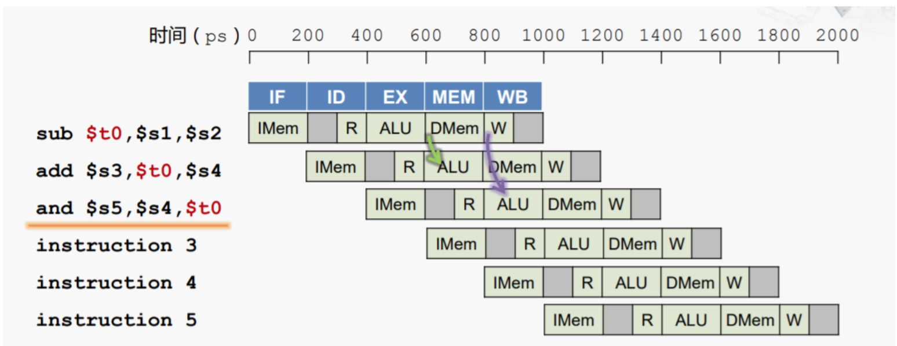

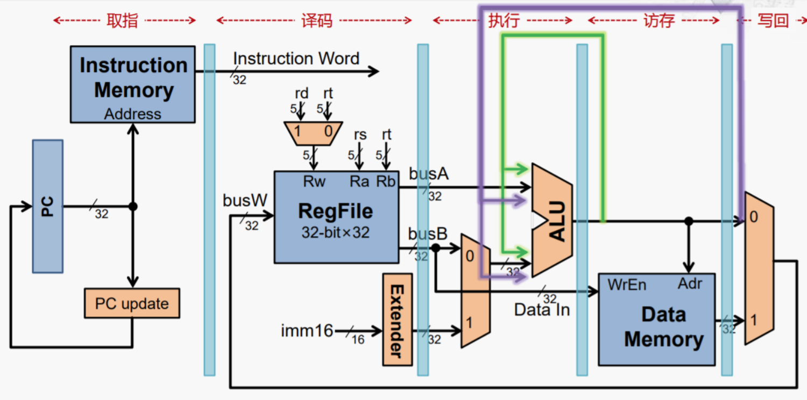

### 3.MEM转发MEM

当上一条指令将MEM中的值写入寄存器

而第二条指令需要将寄存器中的值写入MEM时也需要做转发

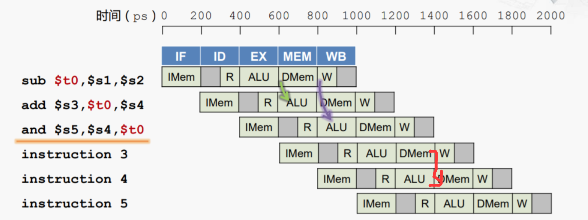

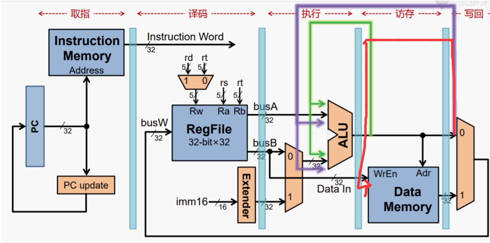

## 5.时序设计

| 阶段   | 取指     | 译码         | 执行         | 访存  | 写回         |
| ------ | -------- | ------------ | ------------ | ----- | ------------ |
| 上边沿 | 取指令   | 取寄存器堆   | ALU运算      | 读/写 | 写回寄存器堆 |
| 下边沿 | 取微指令 | 处理数据转发 | 处理数据转发 |       |              |

## 6.寻址方式

| 寻址方式     | 举例       |
| ------------ | ---------- |
| 寄存器寻址   | add 0 1 2  |
| 立即数寻址   | addi 0 1 2 |
| 基址偏移寻址 | lw 0 1 2   |
| pc相对寻址   | beq 0 1 2  |
| 直接寻址     | j 15       |

## 7.储存结构设计  

使用16bit * 256的rom作为指令rom

使用16bit * 256的rom作为微指令rom

使用8bit * 256的ram作为系统ram

# 五、简单模型机的设计(硬布线实现）

## 1.硬布线指令译码

由于采用了流水线结构 所以硬布线部分实际上被简化为了指令->微指令的译码

因为流水线结构需要一次性取出5个阶段的微指令然后在时钟变化中进行微指令的传递

所以只需要一次译码即可,无需节拍发生器

通过opcode将指令分为4种 00xxx 01xxx 10xxx 11xxx

然后每种指令对应一个3-8译码器进行后3bit的译码

3-8译码器作为每个微指令生成器的生成使能控制

可以实现只使用组合逻辑而无需时钟就能运行的译码结构

见:附录硬布线译码器

## 2.分支延迟缩短

如果采用alu计算分支 则需要两个nop才能完成分支的跳转

通过在译码阶段后加入分支运算器 可以实现jr beq bne beqz bnez只需要一个nop即可完成跳转

而这一个nop可以作为分支延迟槽留给编译器进行优化 进一步提高流水线效率

通过在取指阶段加入pc跳转器件 可以实现j指令无需流水线暂停即可完成跳转

# 六、完整架构

## 1.总体架构

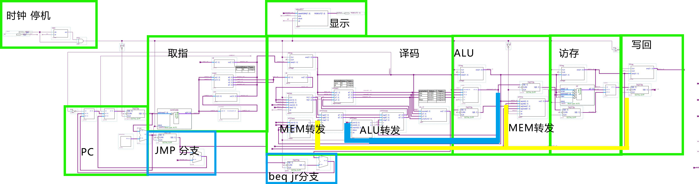

## 2.ALU架构


# 七、汇编器

本项目的指令是使用hex文件加载的

通过hex编码加上一些处理使用python &  c++构造了一个汇编器

可以将mips汇编转为hex文件

同时做一些处理 ,如

- beq和j可以直接使用代码行数跳转

- 省略div mul的第一个参数

| 翻译前                                                       | 翻译后 |
| ------------------------------------------------------------ | ------ |
| addi 5 6 1<br/>addi 1 6 4<br/>addi 2 6 3<br/>addi 3 6 1<br/>beq 2 6 17<br/>nop<br/>and 4 2 3<br/>nop<br/>beq 4 6 13<br/>nop<br/>mul 1 5<br/>mflo 5<br/>srl 2 2 3<br/>mul 1 1<br/>mflo 1<br/>j 5<br/>pln 5 |    :0200000055C1E8<br/>:0200010051C4E8<br/>:0200020052C3E7<br/>:0200030053C1E7<br/>:020004008ACBA5<br/>:020005000000F9<br/>:020006001C4C90<br/>:020007000000F7<br/>:020008008CC3A7<br/>:020009000000F5<br/>:02000A00603460<br/>:02000B007D0076<br/>:02000C004A4C5C<br/>:02000D0060246D<br/>:02000E00790077<br/>:02000F00C0F43B<br/>:02001000D50019    |

# 

# 八、Verilog设计

为减少连线带来的时间浪费,大部分非核心原件使用Verilog设计


## ALU

​	$a、b$ 为二元计算数，$opcode$为传入的操作码，对应$alu$的若干操作(加减、位运算、循环左右移等，具体见代码)，$c$ 为计算结果，$clk$为clock，每次上升沿进行运算，其中$slt$为返回$ ab $的比较值。

```verilog
module alu_codex(
	input [7:0]a,
	input [7:0]b,
	input [5:0]opcode,
	output reg[7:0]c,
	input clk
	);
reg[7:0] temp;
parameter   	Add = 6'b101001,
				Sub = 6'b000110,
				Zero=6'b000011,
				And = 6'b011011,
				Or = 6'b011110,
				Nor = 6'b000001,
				Slt = 6'b011111,
				Addsub1 = 6'b010011,
				Xor = 6'b101100,
				Adt = 6'b111110,
				Bdt = 6'b110100,
				Nota = 6'b100000,
				Notb = 6'b101010,
				Lshift = 6'b000101,
				Rshift = 6'b000111;
always @(posedge clk)
begin
  case(opcode)
	Add:
		begin
			c = a + b;
		end
   Sub:
		begin
			c = a - b;
		end
	Zero:	
		begin
			c = 8'h00;
		end
	Nor:
		begin
			temp = a|b;
			c = ~temp;
		end
	Slt:
		begin
			if(a > b) begin
				c = {8'b00000001};
			end else begin
				c = {8'b00000000};
			end
		end
	Addsub1:
		begin
			temp=0;
			temp=a[7:0]+b[7:0];
			c=temp;
			temp=0;
			temp=c[7:0]-{1'b1};
			c=temp;
		end
   And:
      begin
			c = a&b;
      end
    Or:
		begin
         c = a|b;
      end
	Xor:
		begin
			c = a^b;
		end
	Adt:
		begin
			c = a;
		end
	Bdt:
		begin
			c = b;
		end
   Nota:
		 begin
			c = ~a;
		 end
	Notb:
		 begin
			c = ~b;
		 end
		 
	Lshift:
     begin
		if(b >= 8) begin
			c = {8'h00};
		end
		else if(b == 7)
			c = {a[0],{7'b0000000}};
		else if(b == 6)
			c = {a[1],a[0],{6'b000000}};
		else if(b == 5)
			c = {a[2],a[1],a[0],{5'b00000}};
		else if(b == 4)
			c = {a[3],a[2],a[1],a[0],{4'b0000}};
		else if(b == 3)
			c = {a[4],a[3],a[2],a[1],a[0],{3'b000}};
		else if(b == 2)
			c = {a[5],a[4],a[3],a[2],a[1],a[0],{2'b00}};
		else if(b == 1)
			c = {a[6],a[5],a[4],a[3],a[2],a[1],a[0],{1'b0}};
		else
			c = {a[7],a[6],a[5],a[4],a[3],a[2],a[1],a[0]};
	  end
  Rshift:
     begin
		if(b >= 8) begin
			c = {8'h00};
		end
		else if(b == 7)
			c = {{7'b0000000},a[7]};
		else if(b == 6)
			c = {{6'b000000},a[7],a[6]};
		else if(b == 5)
			c = {{5'b00000},a[7],a[6],a[5]};
		else if(b == 4)
			c = {{4'b0000},a[7],a[6],a[5],a[4]};
		else if(b == 3)
			c = {{3'b000},a[7],a[6],a[5],a[4],a[3]};
		else if(b == 2)
			c = {{2'b00},a[7],a[6],a[5],a[4],a[3],a[2]};
		else if(b == 1)
			c = {{1'b0},a[7],a[6],a[5],a[4],a[3],a[2],a[1]};
		else
			c = {a[7],a[6],a[5],a[4],a[3],a[2],a[1],a[0]};
	  end
     endcase
   end
endmodule
```

## 逻辑ALU

$aluv2$

​	$opcode$，6位操作码，$xy$是跳转的二元组，根据操作码和$jumpnum$来决定输出端$out$的结果。

​	$beq$，$xy$ 相等时跳转。

​	$bne$，$xy$不相等时跳转。

​	$Jr$， 跳转到$x$。

​	$beqz$，$x$为0时跳转。

​	$benz$，$x$不为0时跳转。

```verilog
module alu_v2(
	input [5:0]opcode,
	input [7:0]x,
	input [7:0]y,
	input [7:0]jumpNum,
	output reg[7:0] out
);
parameter   	Beq = 6'b001000,
				Bne = 6'b001001,
				Jr  = 6'b001010,
				Beqz= 6'b001011,
				Benz= 6'b001100;
always @ (*)
	begin
		case(opcode)
			Beq:
				begin
					if(x == y) begin
						out = jumpNum;
					end else begin
						out = {8'b00000001};
					end
				end
			Bne:
				begin
					if(x != y) begin
						out = jumpNum;
					end else begin
						out = {8'b00000001};
					end
				end
			Jr :
				begin out = x; end
			Beqz:
				begin
					if(x == 0) begin
						out = jumpNum;
					end else begin
						out = {8'b00000001};
					end
				end
			Benz:
				begin
					if(x != 0) begin
						out = jumpNum;
					end else begin
						out = {8'b00000001};
					end
				end
		endcase
	end
endmodule 
```

## 二选一

$chooser$

通过 $xy$ 的01判断输出端的 $ans$ 选 $a$ or $b$。

```verilog
module chooser(a,b,x,y,ans);
	input x,y;
	input [4:0]a;
	input [7:0]b;
	output [7:0]ans;
	reg [7:0]ans;
	always@ (x,y)
		begin
			if(x)
				ans = a;
			else if(y)
				ans = b;
			else
				ans = 0;
		end
endmodule 
```

## 三选二

$chooser2$

$chooser$ 的三变量版本，zero为输出端 $abc$ 置0，其他操作实质是改变$xyz$顺序后输出。

```verilog
module chooser2(op,z,x,y,a,b,c);
	input [1:0] op;
	input [7:0] x;
	input [7:0] y;
	input [7:0] z;
	output [7:0]a;
	output [7:0]b;
	output [7:0]c;
	//abc ab bc ac
	reg [7:0]a;
	reg [7:0]b;
	reg [7:0]c;
	parameter 	zero  = 2'b00,
				  dt  = 2'b01,
				yzab  = 2'b10,
				xzab  = 2'b11;
	always @(op or x or y or z)
		begin
			case(op)
				zero:
					begin
						a = 0;
						b = 0;
						c = 0;
					end
				dt:
					begin
						a = x;
						b = y;
						c = z;
					end
				yzab:
					begin
						a = y;
						b = z;
						c = x;
					end
				xzab:
					begin
						a = x;
						b = z;
						c = y;
					end
			endcase
		end
endmodule 
				
```

## 三选一

$chooser3$

根据 $opcode$ 三选一，op1时将 a 传到输出端 d 。

```verilog
module chooser3(
	input [5:0] opcode,
	input [7:0] a,
	input [7:0] b,
	input [7:0] c,
	output reg[7:0] d
);
parameter	op1 = 6'b100010,
			op2 = 6'b100100;
always @(*)
begin
	if(opcode == op1) begin
			d = b;
		end
	else if(opcode == op2) begin
			d = c;
		end
	else begin
			d = a;
		end
end
endmodule 
```

## clock锁&停机

$clean$

​	每次上升沿时，若 $clr$ 为真，输出端 out 为 1，否则置 0 。

```verilog
module clean(
	input clk,
	input clr,
	output reg out
);

always @ (posedge clk)
	begin
		out <= 0;
		if(clr) begin
			out <= 1;
		end else begin
			out <= 0;
		end
	end

endmodule
```

$d3$

直传，输入端 $in$ 传给输出端 $out$ ，主要用来解决 $quartus$ 的连线问题。

```verilog
module d3(in,out);
	input [2:0] in;
	output [2:0] out;
	reg [2:0] out;
	always @(in)
		begin
			out = in;
		end
endmodule 
```

$d8$

同上，不同处在于输入输出为 8 位二进制数。

```verilogve
module d8(in,out);
	input [7:0] in;
	output [7:0] out;
	reg [7:0] out;
	always @(in)
		begin
			out = in;
		end
endmodule 
```

$d13$

同上，不同处在于输入输出为 13 位二进制数。

```verilog
module d13(in,out);
	input [12:0] in;
	output reg [12:0] out;
	always @(*)
		begin
			out = in;
		end
endmodule 
```

## 32bit D触发器

$DDreg$

32位版的D触发器，CLR拉低是清零，每次上升沿赋值，将 $data$ 传递给输出端 $ans$ 。

```verilog
module DDreg(CLK,CLR,data,ans);
	input CLK,CLR;
	input [31:0] data;
	output [31:0] ans;
	reg [31:0] ans;
	always @(posedge CLK or negedge CLR)
		if(!CLR)
			ans = 0;
		else
			ans = data;
endmodule 
```

## 数据冒险检测

$diffCheck$

​	用来判断写回 $wBack$ 拉高时， $pick1$ , $pick2$ 是否与 $wdpick3$ 相同，$pick1$ = $wdpick3$ 则输出端 a 为 1，否则为0， $pick2$ = $wdpick3$ 则输出端 b 为 1，否则为 0 。

```verilog
module diffCheck(pick1,pick2,wdpick3,wBack,a,b,clk);
	input [2:0] pick1;
	input [2:0] pick2;
	input [2:0] wdpick3;
	input wBack;
	input clk;
	output a;
	output b;
	reg a;
	reg b;
	always@(posedge clk)
		begin
			if(pick1 == wdpick3 && wBack==1)
				a = 1;
			else
				a = 0;
			if(pick2 == wdpick3&&wBack==1)
				b = 1;
			else
				b = 0;
		
		end
endmodule 
```

$diffChoose$

根据 $xy$ 的值来决定输出端 $ab$ 是 $regab$ 还是 $wreg$ 。

$x = 1$  -> $a = wreg$  else  $a = regA$

$y = 1$   -> $b = wreg$  else  $b = regB$

```verilog
module diffChoose(regA,regB,wreg,x,y,a,b);
	input [7:0] regA;
	input [7:0] regB;
	input [7:0] wreg;
	input x;
	input y;
	output [7:0] a;
	output [7:0] b;
	reg [7:0] a;
	reg [7:0] b;

	always @(x,y,wreg,regA,regB)
		begin
			if(x == 1)
				a = wreg;
			else
				a = regA;
			if(y == 1)
				b = wreg;
			else
				b = regB;
		end
endmodule 
```

$diffOne$

通过 $regIdA,regIdB$ ，$reg$的id来判断输出端的值，如果 $Ida = Idb$ 且 $wd$ 拉高，输出端 out 的值是 $regDataB$ ,否则是 $regDataA$。

```verilog
module diffOne(regIdA,regIdB,regDataA,regDataB,wd,out,clk);
	input [2:0] regIdA;
	input [2:0] regIdB;
	input [7:0] regDataA;
	input [7:0] regDataB;
	input wd;
	input clk;
	output [7:0] out;
	reg [7:0] out;

	always @(posedge clk)
		begin
			if(wd == 1 && regIdA == regIdB )
				out = regDataB;
			else
				out = regDataA;
		end
endmodule 
```

## 除法器

$div$

计算 a/b (整数除法，向下取整)，输出端 $yyushu$ 为余数， $yshang$ 为商。

```verilog
module div
(
	input[7:0] a,
	input[7:0] b,
	output reg [7:0] yyushu,
	output reg [7:0] yshang
);
 
reg[7:0] tempa;
reg[7:0] tempb;
reg[15:0] temp_a;
reg[15:0] temp_b;
 
integer i;
 
always @(a or b)
begin
    tempa <= a;
    tempb <= b;
end
 
always @(tempa or tempb)
begin
    temp_a = {8'h00,tempa};
    temp_b = {tempb,8'h00}; 
    for(i = 0;i < 8;i = i + 1)
        begin
            temp_a = {temp_a[14:0],1'b0};
            if(temp_a[15:8] >= tempb)
                temp_a = temp_a - temp_b + 1'b1;
            else
					temp_a = temp_a;
        end
    yshang <= temp_a[7:0];
    yyushu <= temp_a[15:8];
end
endmodule
```

$iszero$

​	判断输入端 a 是否是 0 ， a = 0 则输出端赋值为 b，否则为 00000010 。

```verilog
module iszero(a,b,ans);
	input [7:0]a;
	input [7:0]b;
	output [7:0]ans;
	reg [7:0] ans;
	always@(a,b)
		begin
			if(a == 0)
				ans = b;
			else
				ans = {8'b00000010};
		end
endmodule 
```

$jjcc$

用来统一处理加减乘除法的结果，当opcode是乘除法时，输出结果分高低位，$h$ 和 $l$ ,加减结果存在 $b$ 中。

```verilog
module jjcc(
	input [5:0] opcode,
	input [7:0] a,
	input [7:0] bh,
	input [7:0] bl,
	input [7:0] ch,
	input [7:0] cl,
	output reg[7:0] h,
	output reg[7:0] l,
	output reg[7:0] b,
	output reg check
);
parameter	mul = 6'b000010,
				div = 6'b000100;
always @(*)
begin
	if(opcode == div) begin
			h = ch;
			l = cl;
			b = {8'h00};
			check = 1;
		end
	else if(opcode == mul) begin
			h = bh;
			l = bl;
			b = {8'h00};
			check = 1;
		end
	else begin
			h = {8'h00};
			l = {8'h00};
			b = a;
			check = 0;
		end
end
endmodule 
```

$myand$

x = 1 时，输出端 c 结果为 a。

x = 0 ，y = 1 ，输出端 c 结果为 b。

否则输出端 c 置 0 。

```verilog
module myand(x,y,a,b,c);
output [7:0] c;
input [7:0] a;
input [7:0] b;
input x,y;
reg[7:0] c;

always @(*)
begin
	if(x)
		c = a;
	else if(y)
		c = b;
	else
        c = {8'h00};
end
endmodule
```

## 寄存器堆

$regheap$

一个维护寄存器的堆。

堆内维护了8个寄存器，当 $wd$ 拉高时，将 $data$ 写入编号为 $wdpick$ 的寄存器，输出端是堆中两个寄存器元素的值，输出编号为 $pick$ 的寄存器元素的值。

```verilog
module regheap(CLK,pick1,pick2,wdpick,data,wd,R1,R2);

	input CLK;
	input [2:0] pick1;
	input [2:0] pick2;
	input [2:0] wdpick;
	input [7:0] data;
	input wd;
	output [7:0] R1;
	output [7:0] R2;
	reg [7:0] R1;
	reg [7:0] R2;
	reg [7:0] R[7:0];
	always @(posedge CLK)
		begin
			if(wd==1)
				R[wdpick]=data;
			if(wdpick==pick1&&wd==1)
				R1=data;
			else
				R1=R[pick1];
			if(wdpick==pick2&&wd==1)
				R2=data;
			else
				R2 = R[pick2];
		end
endmodule
```

## 微指令译码

$swapit$

根据操作码 $op$ 的不同，将 x 拆成 $abcd$ 四个部分并输出。

```verilog
module swapit(op,x,a,b,c,d);
	input [1:0] op;
	input [15:0] x;
	output [2:0] a;
	output [2:0] b;
	output [2:0] c;
	output [2:0] d;
	reg [2:0] a;
	reg [2:0] b;
	reg [2:0] c;
	reg [7:0] d;
	parameter   A = 2'b00,
					B = 2'b01,
					C = 2'b10,
					D = 2'b11;
	always @(*)
		begin
			case(op)
				A:
					begin 
						a = x[10:8];
						b = x[7:5];
						c = x[4:2];
						d = {8'b00000000};
					end
				B:
					begin 
						a = x[10:8];
						b = x[7:5];
						c = x[4:2];
						d = {3'b000,x[4:0]};
					end
				C:
					begin 
						a = x[10:8];
						b = x[10:8];
						c = x[7:5];
						d = {3'b000,x[4:0]};
					end 
				D:
					begin 
						a = x[10:8];
						b = x[10:8];
						c = {3'b000};
						d = x[7:0];
					end 
			endcase 
		end 
endmodule 
```

## 8bit超前进位加法器

```verilog
module my74181(C0,C1,C2,C3,C4,C5,C6,C7,C8,G0,G1,G2,G3,G4,G5,G6,G7,P0,P1,P2,P3,P4,P5,P6,P7);
	input C0,G0,G1,G2,G3,G4,G5,G6,G7,P0,P1,P2,P3,P4,P5,P6,P7;
	output C1,C2,C3,C4,C5,C6,C7,C8;
	assign C1 = G0|(P0&C0);
	assign C2 = G1|((P1&G0)|(P1&P0&C0));
	assign C3 = G2|((P2&G1)|(P2&P1&G0)|(P2&P1&P0&C0));
	assign C4 = G3|((P3&G2)|(P3&P2&G1)|(P3&P2&P1&G0)|(P3&P2&P1&P0&C0));
	assign C5 = G4|((P4&G3)|(P4&P3&G2)|(P4&P3&P2&G1)|(P4&P3&P2&P1&G0)|(P4&P3&P2&P1&P0&C0));
	assign C6 = G5|((P5&G4)|(P5&P4&G3)|(P5&P4&P3&G2)|(P5&P4&P3&P2&G1)|(P5&P4&P3&P2&P1&G0)|(P5&P4&P3&P2&P1&P0&C0));
	assign C7 = G6|((P6&G5)|(P6&P5&G4)|(P6&P5&P4&G3)|(P6&P5&P4&P3&G2)|(P6&P5&P4&P3&P2&G1)|(P6&P5&P4&P3&P2&P1&G0)|(P6&P5&P4&P3&P2&P1&P0&C0));
	assign C8 = G7|((P7&G6)|(P7&P6&G5)|(P7&P6&P5&G4)|(P7&P6&P5&P4&G3)|(P7&P6&P5&P4&P3&G2)|(P7&P6&P5&P4&P3&P2&G1)|(P7&P6&P5&P4&P3&P2&P1&G0)|(P7&P6&P5&P4&P3&P2&P1&P0&C0));
endmodule

```


# 九、附录

## 8bit超前进位加法器


## 华莱士乘法器

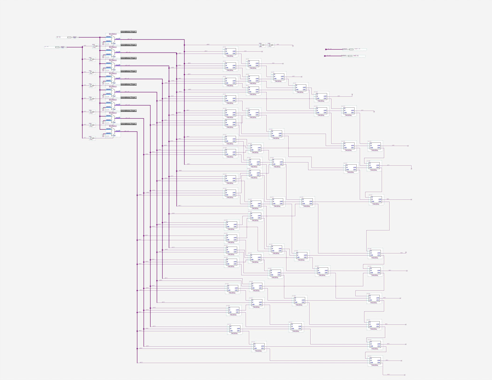

## 硬布线译码器

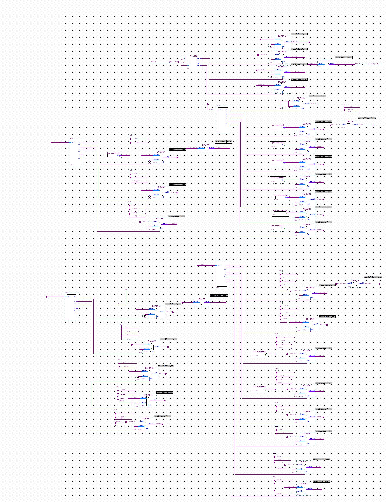

## 实验一总览


## 实验二总览


## 实验三总览

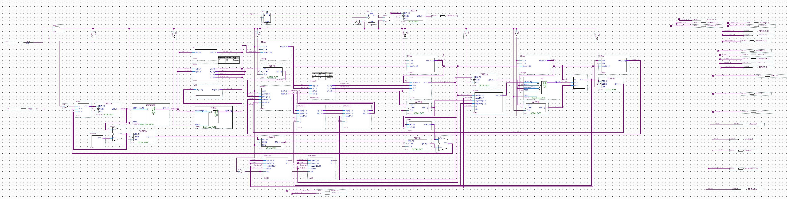

## 实验四总览

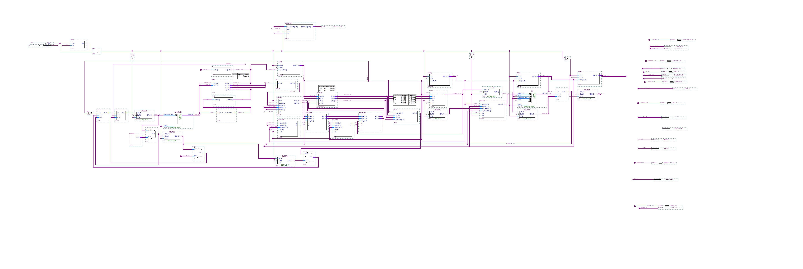